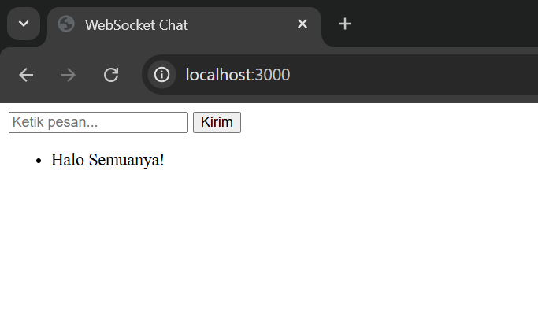
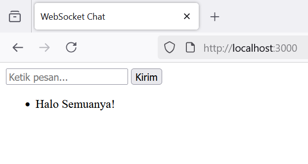
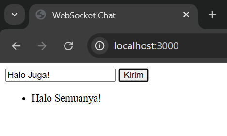
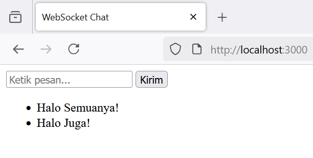

# UTS Web


# 📡 Aplikasi Chat Real-Time Sederhana Menggunakan WebSocket

Proyek ini merupakan bagian dari tugas Ujian Tengah Semester (UTS) mata kuliah **Pemrograman Web**, yang bertujuan untuk memahami dan mengimplementasikan teknologi **WebSocket** dalam membuat aplikasi komunikasi real-time berbasis web.

---

## 🔍 Deskripsi Singkat

WebSocket adalah protokol komunikasi dua arah (full-duplex) yang memungkinkan pertukaran data antara klien (browser) dan server secara terus-menerus tanpa perlu melakukan permintaan berulang (request) seperti pada HTTP biasa. Protokol ini sangat ideal untuk membangun aplikasi **chat**, **notifikasi real-time**, **game multiplayer**, dan **dashboard data langsung**.

---

## 🧪 Eksperimen

Eksperimen dilakukan secara lokal tanpa pembelian server, hanya menggunakan Node.js dan browser modern. Tujuannya adalah untuk menunjukkan bagaimana WebSocket bekerja dalam menyampaikan pesan antar pengguna secara langsung.

---

## 🆚 Perbandingan WebSocket vs HTTP

| Aspek                | HTTP                          | WebSocket                        |
|----------------------|-------------------------------|----------------------------------|
| Tipe Komunikasi      | Satu arah (request-response)  | Dua arah (full-duplex)          |
| Koneksi              | Terus dibuat ulang             | Satu koneksi tetap terbuka      |
| Efisiensi            | Kurang efisien untuk real-time | Sangat efisien untuk real-time  |
| Cocok untuk          | Website biasa, form input      | Chat, game, notifikasi langsung |


## 🛠️ Teknologi yang Digunakan

- HTML + JavaScript (Frontend)
- Node.js + WebSocket (Backend)
- WebSocket Protocol (ws)

---

## 📁 Struktur Folder


```
ws-chat/                      
├── img/                  
│   ├── 1.png
│   ├── 2.png
│   ├── 3.png
│   └── 4.png
├── public/
│   └── index.html
├── .gitignore
├── README
└── server.js
```

5. lalu klik tombol Create repository

## Menambahkan Remote Repository

- Remote Repository merupakan server repositori yang akan digunakan untuk menyimpan segala perubahan yang dilakukan pada repositori lokal, dan bisa diakses oleh banyak pengguna
- Untuk menambahkan remote repository server, gunakan command

```
git remote add origin [url]
```

## Mengirim perubahan ke server (Push)

- Untuk mengirim perubahan pada repositori lokal ke server, gunakan command

```
git push -u origin master
```

## Clone Repository

- git clone digunakan untuk mengambil salinan dari repositori Git dari server ke repositori lokal
- gunakan command ini untuk melakukan kloning ke repositori lokal

```
git clone [url]
```

## 🚀 Cara Menjalankan Aplikasi

1. **Instal dependensi terlebih dahulu:**

```bash
npm install ws
```

2. **Jalankan server WebSocket:**

```bash
node server.js
```

3. **Buka file HTML dari folder public/ melalui browser:**

- Buka dua tab atau dua browser, akses index.html

- Ketik pesan di salah satu tab, dan pesan akan langsung muncul di browser / tab lainnya (real-time chat)

## Hasil Dokumentasi






## ✅ Fitur Aplikasi

- Chat antar tab browser secara real-time

- nput pesan dari pengguna dan respons langsung dari server

- Ringan dan mudah dijalankan secara lokal


## 📚 Kesimpulan
WebSocket membuka peluang besar dalam pengembangan aplikasi web yang cepat, efisien, dan interaktif. Dengan satu koneksi terbuka, kita bisa menciptakan pengalaman pengguna real-time yang sebelumnya sulit dicapai dengan HTTP tradisional.